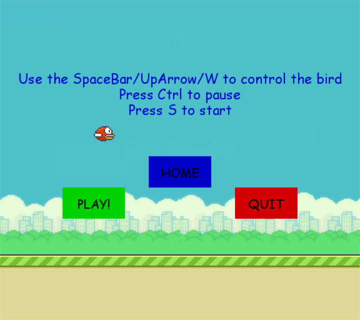

# FlappyBird
A re-creation of the classic game Flappy Bird using Python and Pygame!
### Installing the Requirements
---
1. Install Python 3.x from [here](https://www.python.org/downloads/).
2. Install Pygame 1.9.x from [here](https://pypi.org/project/Pygame/#files), or use pip to install it directly from the command line as follows
``` 
   pip install Pygame
```
Clone this repository using 
```
git clone https://github.com/ThrivikramanV/FlappyBird
``` 
or click `Download ZIP` in the right panel and then extract it.

**NOTE**: The font used in the game is compatible only with Windows. Hence those with UNIX based operating systems should change the font used at line 78 of the file `flappybird.pyw`, to a font which is recognised by your system.

Run the following command from the repository's directory.
```
python flappybird.pyw
```

### GAME VIEW!
---
 
 
 
